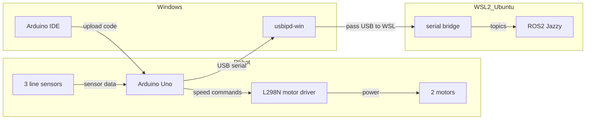
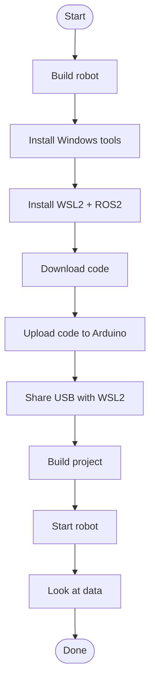

# LineBot ROS2 Telemetry — Simple Guide

This guide shows how to build a small robot that follows a black line. The robot brain is an Arduino Uno. We watch the robot data using ROS2 Jazzy inside WSL2 on a Windows laptop.

## Table of Contents

1. [What This Project Does](#what-this-project-does)
2. [Stuff You Need Before You Start](#stuff-you-need-before-you-start)
3. [Robot Parts](#robot-parts)
4. [Computer Programs You Need](#computer-programs-you-need)
5. [Pictures of How It All Fits Together](#pictures-of-how-it-all-fits-together)
6. [How to Wire the Robot](#how-to-wire-the-robot)
7. [Set Up Windows](#set-up-windows)
8. [Set Up WSL2](#set-up-wsl2)
9. [Download the Code](#download-the-code)
10. [Put the Code on the Arduino](#put-the-code-on-the-arduino)
11. [Share the Arduino USB With WSL2](#share-the-arduino-usb-with-wsl2)
12. [Build the ROS2 Project](#build-the-ros2-project)
13. [Run the Whole Thing Step by Step](#run-the-whole-thing-step-by-step)
14. [Start the Robot](#start-the-robot)
15. [See the Robot Data](#see-the-robot-data)
16. [What to Do After Data Starts Showing](#what-to-do-after-data-starts-showing)
17. [Read the Data and Fix the Robot](#read-the-data-and-fix-the-robot)
18. [When Things Go Wrong](#when-things-go-wrong)

---

## What This Project Does

We have a small robot with three line sensors and two motors. It can follow a black line on the floor.

There are two ways to use this project:

1. **Robot thinks for itself** — The Arduino runs the line-following code. ROS2 only watches the data. Use `telemetry_only.launch.py` for this.
2. **Computer tells robot what to do** — ROS2 on the laptop reads the sensors, decides motor speeds, and sends commands to the Arduino. Use `line_follower.launch.py` for this.

When the robot runs, it sends out data called **telemetry**. The data shows up as ROS2 **topics**. Think of topics like TV channels. Each channel shows one type of data:

- `/sensor_data` — what the three line sensors see
- `/line_error` — how far left or right the robot is from the line
- `/pid_terms` — math numbers the robot uses to stay on the line
- `/motor_pwm` — how fast each motor is spinning

## Stuff You Need Before You Start

Make sure you have all of this before you begin.

| Thing | Why You Need It | What It Needs to Work |
|-------|-----------------|-----------------------|
| Robot parts | The robot needs a brain, eyes, and wheels | Arduino Uno, L298N, motors, sensors, battery, correct wiring |
| Windows laptop | This is the main computer | Windows 10 or 11, WSL2 turned on, admin access |
| Arduino IDE | This puts robot code onto the Arduino | Download from Arduino website, USB cable |
| `usbipd-win` | This shares the Arduino USB with WSL2 | Install with PowerShell as admin |
| WSL2 Ubuntu | This is a Linux computer inside Windows | Ubuntu 22.04 or 24.04 |
| ROS2 Jazzy | This is the robot software system | Installed inside WSL2 |
| `linebot_ws` | This is the project folder | Git, `colcon`, `python3-serial` |
| Serial bridge | This reads Arduino data and sends it to ROS2 | A working `/dev/ttyACM*` port |

## Robot Parts

| Part | What It Is |
|------|------------|
| Arduino Uno | The robot brain. VID:PID `2341:0043` or `2341:0069`. |
| L298N | A chip that makes the motors spin. |
| 2 DC motors + chassis | The wheels and body of the robot. |
| 3 TCRT5000 sensors | The robot eyes. Left, center, right. |
| Breadboard + jumper wires | Used to connect things together. |
| USB cable | Connects Arduino to laptop. Use a good, short cable. |
| Windows laptop | Runs everything. |
| 7–12 V battery | Powers the motors. |

## Computer Programs You Need

### On Windows

- Windows 10 or 11 with WSL2 enabled
- [Arduino IDE](https://www.arduino.cc/en/software)
- [usbipd-win](https://github.com/dorssel/usbipd-win)
- Git

### Inside WSL2 Ubuntu

- Ubuntu 22.04 or 24.04
- ROS2 Jazzy Jalisco — install guide: <https://docs.ros.org/en/jazzy/Installation.html>
- Python serial library:
  ```bash
  sudo apt install python3-serial
  ```

## Pictures of How It All Fits Together

### Big picture



### Robot thinks for itself mode

```mermaid
flowchart LR
    A[Arduino Uno
       linebot_onboard.ino]
    S[USB port
       /dev/ttyACM0]
    B[serial bridge]
    SD[/sensor_data]
    LE[/line_error]
    PT[/pid_terms]
    MP[/motor_pwm]

    A -->|telemetry text| S
    S -->|read data| B
    B --> SD
    B --> LE
    B --> PT
    B --> MP
```

### Computer tells robot what to do mode

```mermaid
flowchart LR
    A[Arduino Uno
       linebot.ino]
    S[USB port
       /dev/ttyACM0]
    B[serial bridge]
    C[controller node]
    Cmd[/cmd_vel]
    SD[/sensor_data]
    LE[/line_error]
    PT[/pid_terms]

    A -->|sensor data| S
    S -->|read data| B
    B --> SD
    B --> LE
    C -->|compute PID| PT
    C -->|speed command| Cmd
    Cmd -->|P:left,right| B
    B -->|write data| S
    S -->|motor command| A
```

### Steps from start to finish



## How to Wire the Robot

### Line sensors to Arduino

| Sensor wire | Arduino pin |
|-------------|-------------|
| Left sensor analog output | A0 |
| Center sensor analog output | A1 |
| Right sensor analog output | A2 |
| VCC | 5 V |
| GND | GND |

If your sensor has a digital output pin, you do not need it. Only use the analog output.

### L298N motor driver to Arduino

| L298N pin | Arduino pin |
|-----------|-------------|
| ENA | D5 |
| IN1 | D6 |
| IN2 | D7 |
| IN3 | D8 |
| IN4 | D9 |
| ENB | D10 |
| +12 V | Battery positive (+) |
| GND | Battery negative (−) **and** Arduino GND |
| +5 V | Not used |

### Motors to L298N

| Motor | L298N output |
|-------|--------------|
| Left motor | OUT1 and OUT2 |
| Right motor | OUT3 and OUT4 |

> **Very important:** Connect the L298N GND pin to both the battery negative and the Arduino GND. If you skip this, the robot may act weird or not move.

## Set Up Windows

1. **Install Arduino IDE**
   Download it from <https://www.arduino.cc/en/software> and install it.

2. **Install usbipd-win**
   Open PowerShell as Administrator and run:
   ```powershell
   winget install usbipd
   ```
   Restart your computer if it asks you to.

3. **Check that WSL2 is installed**
   Open PowerShell and run:
   ```powershell
   wsl --version
   ```
   If WSL2 is not installed, install it first.

## Set Up WSL2

1. **Install ROS2 Jazzy**
   Follow this guide: <https://docs.ros.org/en/jazzy/Installation.html>

2. **Install helper programs**
   Open a WSL terminal and run:
   ```bash
   sudo apt update
   sudo apt install -y python3-pip python3-serial git
   ```

3. **Add your user to the dialout group**
   This lets you use serial ports without `sudo`:
   ```bash
   sudo usermod -a -G dialout $USER
   ```
   Then restart WSL or log out and back in.

## Download the Code

You need two copies of the code. One on Windows for editing. One in WSL2 for running.

### Windows copy

```powershell
cd C:\
git clone https://github.com/Vishalnar26/linebot.git
```

### WSL2 copy

```bash
cd ~
git clone https://github.com/Vishalnar26/linebot.git
```

## Put the Code on the Arduino

1. Open Arduino IDE on Windows.
2. Plug the Arduino Uno into the laptop with USB.
3. In Arduino IDE, click **Tools → Port** and pick the COM port.
4. Open one of these files:
   - `arduino/linebot/linebot_onboard.ino` — robot thinks for itself
   - `arduino/linebot/linebot.ino` — computer tells robot what to do
5. Click the **Upload** button.
6. Open **Tools → Serial Monitor** and set it to `115200` baud.
7. You should see lines like this:
   ```
   A_Raw:469,513,142 E:-0.291 P:-44 D:-6 PWM:50,150
   ```
   This means the Arduino is working.

## Share the Arduino USB With WSL2

Windows sees the Arduino first. We use `usbipd-win` to share it with WSL2.

1. Open PowerShell as Administrator.
2. List USB devices:
   ```powershell
   usbipd list
   ```
   Find the Arduino Uno. Remember its bus ID, like `2-3`.

3. Bind the device. You only need to do this once:
   ```powershell
   usbipd bind --busid 2-3
   ```

4. Attach the device to WSL2:
   ```powershell
   usbipd attach --wsl --busid 2-3 --auto-attach
   ```

5. Inside WSL2, check that the Arduino appears:
   ```bash
   ls /dev/ttyACM* /dev/ttyUSB*
   ```
   You should see something like `/dev/ttyACM0`.

6. Give yourself permission to use the port:
   ```bash
   sudo chmod 666 /dev/ttyACM0
   ```

7. Test that data is coming through:
   ```bash
   stty -F /dev/ttyACM0 -hupcl
   cat /dev/ttyACM0
   ```
   Press `Ctrl+C` to stop. You should see telemetry lines.

> **Why `-hupcl`?** This stops the Arduino from resetting when the port opens. Resetting over USB/IP can make the connection unstable.

## Build the ROS2 Project

Run these commands inside WSL2:

```bash
cd ~/linebot/linebot_ws
source /opt/ros/jazzy/setup.bash
colcon build --symlink-install
source install/setup.bash
```

Every time you update the code with `git pull`, run these commands again:

```bash
cd ~/linebot/linebot_ws
source /opt/ros/jazzy/setup.bash
colcon build --symlink-install
source install/setup.bash
```

## Run the Whole Thing Step by Step

Do these steps in order.

### 1. Build the robot

Connect the motors, L298N, sensors, and battery as shown in [How to Wire the Robot](#how-to-wire-the-robot). Then plug the Arduino into the laptop with USB.

### 2. Set up Windows

- Install Arduino IDE.
- Install `usbipd-win`:
  ```powershell
  winget install usbipd
  ```
- Restart if asked.
- Check WSL2:
  ```powershell
  wsl --version
  ```

### 3. Set up WSL2

- Install ROS2 Jazzy.
- Install helper programs:
  ```bash
  sudo apt update
  sudo apt install -y python3-pip python3-serial git
  ```
- Add yourself to the dialout group:
  ```bash
  sudo usermod -a -G dialout $USER
  ```
  Then restart WSL2 or log out and back in.

### 4. Download the code

- On Windows:
  ```powershell
  cd C:\
  git clone https://github.com/Vishalnar26/linebot.git
  ```
- In WSL2:
  ```bash
  cd ~
  git clone https://github.com/Vishalnar26/linebot.git
  ```

### 5. Upload code to the Arduino

- Open Arduino IDE.
- Pick the COM port.
- Open `arduino/linebot/linebot_onboard.ino` for robot-thinks mode, or `arduino/linebot/linebot.ino` for computer-tells mode.
- Click Upload.
- Open Serial Monitor at `115200` baud and check for telemetry lines.

### 6. Share the Arduino USB with WSL2

- In PowerShell as Administrator:
  ```powershell
  usbipd list
  usbipd bind --busid 2-3
  usbipd attach --wsl --busid 2-3 --auto-attach
  ```
- In WSL2:
  ```bash
  ls /dev/ttyACM* /dev/ttyUSB*
  sudo chmod 666 /dev/ttyACM0
  stty -F /dev/ttyACM0 -hupcl
  cat /dev/ttyACM0
  ```
  Press `Ctrl+C` after you see data.

### 7. Build the project

```bash
cd ~/linebot/linebot_ws
source /opt/ros/jazzy/setup.bash
colcon build --symlink-install
source install/setup.bash
```

### 8. Start the robot

For robot-thinks mode:

```bash
ros2 launch line_follower telemetry_only.launch.py serial_port:=/dev/ttyACM0
```

For computer-tells mode:

```bash
ros2 launch line_follower line_follower.launch.py serial_port:=/dev/ttyACM0
```

If the device is `/dev/ttyACM1`, change the command to use that.

### 9. Look at the data

Open a second WSL terminal and run:

```bash
source /opt/ros/jazzy/setup.bash
source ~/linebot/linebot_ws/install/setup.bash
ros2 topic echo /sensor_data
```

You can also look at `/line_error`, `/pid_terms`, and `/motor_pwm`.

If a step fails, check [When Things Go Wrong](#when-things-go-wrong).

## Start the Robot

### Robot thinks for itself

Use this when the Arduino runs the line-follower code and you just want to watch the data.

```bash
source /opt/ros/jazzy/setup.bash
source ~/linebot/linebot_ws/install/setup.bash
ros2 launch line_follower telemetry_only.launch.py serial_port:=/dev/ttyACM0
```

If the port is `/dev/ttyACM1`:

```bash
ros2 launch line_follower telemetry_only.launch.py serial_port:=/dev/ttyACM1
```

### Computer tells robot what to do

First upload `arduino/linebot/linebot.ino`, then run:

```bash
source /opt/ros/jazzy/setup.bash
source ~/linebot/linebot_ws/install/setup.bash
ros2 launch line_follower line_follower.launch.py serial_port:=/dev/ttyACM0
```

## See the Robot Data

Open a new WSL terminal and run:

```bash
source /opt/ros/jazzy/setup.bash
source ~/linebot/linebot_ws/install/setup.bash
```

Then pick a topic to watch:

```bash
ros2 topic echo /sensor_data
ros2 topic echo /line_error
ros2 topic echo /pid_terms
ros2 topic echo /motor_pwm
```

To see all topics and nodes:

```bash
ros2 topic list
ros2 node list
```

## What to Do After Data Starts Showing

Once you see data with `ros2 topic echo`, the hard part is done. Now you can:

1. Draw graphs of the data with `rqt_plot`
2. Drive the robot with your keyboard
3. Save the data to a file called a bag

### 1. Draw graphs with `rqt_plot`

Install it once:

```bash
sudo apt update
sudo apt install -y ros-jazzy-rqt-plot ros-jazzy-rqt
```

Start it with some topics already loaded:

```bash
source /opt/ros/jazzy/setup.bash
source ~/linebot/linebot_ws/install/setup.bash
ros2 run rqt_plot rqt_plot /line_error/data /sensor_data/data[0] /sensor_data/data[1] /sensor_data/data[2]
```

Or start it empty and add topics yourself:

```bash
ros2 run rqt_plot rqt_plot
```

Then type each topic into the **Topic** box and press Enter:

```
/line_error/data
/sensor_data/data[0]
/sensor_data/data[1]
/sensor_data/data[2]
/pid_terms/data[0]
/pid_terms/data[2]
/motor_pwm/data[0]
/motor_pwm/data[1]
```

What each topic means:

| Topic | Meaning |
|-------|---------|
| `/sensor_data/data[0]` | Left sensor value |
| `/sensor_data/data[1]` | Center sensor value |
| `/sensor_data/data[2]` | Right sensor value |
| `/pid_terms/data[0]` | P part of PID math |
| `/pid_terms/data[2]` | D part of PID math |
| `/motor_pwm/data[0]` | Left motor speed |
| `/motor_pwm/data[1]` | Right motor speed |

#### If `rqt_plot` does not work

| Problem | Why It Happens | How to Fix |
|---------|----------------|------------|
| `rqt_plot: command not found` | The program is not in PATH | Use `ros2 run rqt_plot rqt_plot ...` |
| Window opens but no graph | No topics added | Type a topic and press Enter |
| Graph updates very slowly | Slow data or slow screen | Run `ros2 topic hz /sensor_data` to check speed |
| Window does not open | No graphics support in WSL2 | Use `ros2 topic echo` or save a bag instead |

### 2. Drive the robot with your keyboard

Install the keyboard driver once:

```bash
sudo apt install -y ros-jazzy-teleop-twist-keyboard
```

Run it in a new WSL terminal:

```bash
source /opt/ros/jazzy/setup.bash
source ~/linebot/linebot_ws/install/setup.bash
ros2 run teleop_twist_keyboard teleop_twist_keyboard
```

Use these keys to drive:

| Key | What It Does |
|-----|--------------|
| `i` | Go forward |
| `,` | Go backward |
| `j` | Turn left in place |
| `l` | Turn right in place |
| `u` / `o` | Go forward and turn |
| `k` | Stop |
| `q` | Speed up |
| `z` | Slow down |
| `w` | Turn faster |
| `x` | Turn slower |
| `Ctrl+C` | Quit |

This sends `/cmd_vel` commands to the robot. It only works if you uploaded `linebot.ino` and started `line_follower.launch.py`.

#### If teleop does not work

| Problem | Why It Happens | How to Fix |
|---------|----------------|------------|
| Keys do nothing | You are in telemetry-only mode | Upload `linebot.ino` and use `line_follower.launch.py` |
| Robot goes backward instead of forward | Motor wires are swapped | Swap the two wires on one motor |
| Robot only spins | Motors are not balanced | Tune PID values in `config/pid_params.yaml` |

### 3. Save data to a bag file

Install the bag tool once:

```bash
sudo apt install -y ros-jazzy-ros2bag ros-jazzy-rosbag2-storage-default-plugins
```

Start recording:

```bash
cd ~/linebot/bags
source /opt/ros/jazzy/setup.bash
source ~/linebot/linebot_ws/install/setup.bash
ros2 bag record /sensor_data /line_error /pid_terms /motor_pwm
```

Press `Ctrl+C` to stop. It makes a folder like `rosbag2_2026_08_28-15_52_21`.

Look inside the bag:

```bash
ros2 bag info rosbag2_2026_08_28-15_52_21
```

Play it back later:

```bash
ros2 bag play rosbag2_2026_08_28-15_52_21
```

When you play it back, you can use `rqt_plot` or `ros2 topic echo` just like the robot is live.

#### If bag recording does not work

| Problem | Why It Happens | How to Fix |
|---------|----------------|------------|
| `ros2: command not found` | ROS2 not loaded | Run both `source` commands |
| `ros2 bag` not found | Bag tool not installed | Install `ros-jazzy-ros2bag` and plugins |
| Bag has zero messages | Connection was lost before recording | Check `ros2 topic hz /sensor_data` first |

## Read the Data and Fix the Robot

### What good data looks like

- `/sensor_data` — values go low when a sensor sees the black line, high on white floor.
- `/line_error` — near `0` when centered, negative when line is to the left, positive when line is to the right.
- `/motor_pwm` — one motor faster than the other when the robot turns back to the line.

### What bad data means

| What You See | What It Means | What to Change |
|--------------|---------------|----------------|
| `/line_error` stays at `+1` or `-1` | Robot cannot see the line | Move sensors closer or check if a sensor is broken |
| `/line_error` jumps up and down fast | PID numbers are too aggressive | Lower `Kp` or raise `Kd` |
| Robot turns back too slowly | PID numbers are too weak | Raise `Kp` |
| Robot wiggles left and right constantly | `Kp` is too high | Lower `Kp` |
| One motor is much slower | Motors are not the same | Swap motors or adjust speed in code |
| Motor speed stays at `255` a lot | Robot cannot keep up | Lower base speed or use a stronger battery |
| Data comes in slowly or stops | USB connection is unstable | Try a different USB cable or port |

### How to tune the robot

1. Save a bag while the robot drives on the line.
2. Plot `/line_error`.
3. If it wiggles too much, lower `Kp`. If it turns too slow, raise `Kp`.
4. Change PID numbers in the right file:
   - If Arduino runs PID: edit `arduino/linebot/linebot_onboard.ino` and upload again.
   - If ROS2 runs PID: edit `linebot_ws/src/line_follower/config/pid_params.yaml`, then rebuild:
     ```bash
     cd ~/linebot/linebot_ws
     source /opt/ros/jazzy/setup.bash
     colcon build --symlink-install
     source install/setup.bash
     ```
5. Record another bag and compare.
6. Keep doing this until the robot follows the line smoothly.

## When Things Go Wrong

### `Serial read error: device reports readiness to read but returned no data`

The USB connection had a small hiccup. The serial bridge will retry. If it keeps working after the error, you can ignore it. If it keeps happening over and over, see the steps below.

### Arduino shows up as `/dev/ttyACM1`

Just use `/dev/ttyACM1` in your commands. If it keeps changing, try a different USB cable or port.

### `cat /dev/ttyACM0` shows nothing

1. Detach the Arduino from WSL2 in PowerShell:
   ```powershell
   usbipd detach --busid 2-3
   ```
2. Upload the firmware again from Arduino IDE on Windows.
3. Re-attach:
   ```powershell
   usbipd attach --wsl --busid 2-3 --auto-attach
   ```
4. Test `cat /dev/ttyACM0` again.

### `usbipd list` shows `DFU-RT Port`

The Arduino went into bootloader mode. Detach it, upload the firmware again, and re-attach.

### `Permission denied` on `/dev/ttyACM0`

Run:

```bash
sudo chmod 666 /dev/ttyACM0
```

Or add yourself to the dialout group and restart WSL2:

```bash
sudo usermod -a -G dialout $USER
wsl --shutdown
```

### TCP bridge backup plan

If `usbipd` never works well, you can keep the Arduino plugged into Windows and send its data over the network to WSL2. Ask if you want help setting this up.

### How to update code

- Edit files in `C:\linebot` on Windows.
- Commit and push from Windows:
  ```powershell
  cd C:\linebot
  git add .
  git commit -m "what changed"
  git push
  ```
- Pull and rebuild in WSL2:
  ```bash
  cd ~/linebot
  git pull
  cd linebot_ws
  source /opt/ros/jazzy/setup.bash
  colcon build --symlink-install
  source install/setup.bash
  ```

---

For more about USB/IP, see [Microsoft's WSL USB guide](https://learn.microsoft.com/windows/wsl/connect-usb).